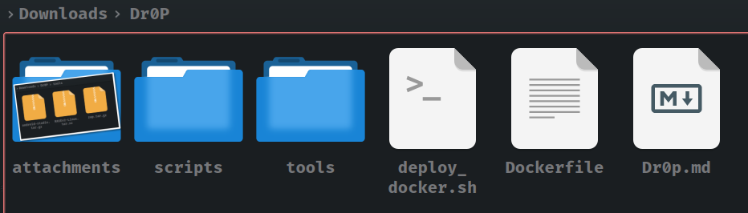
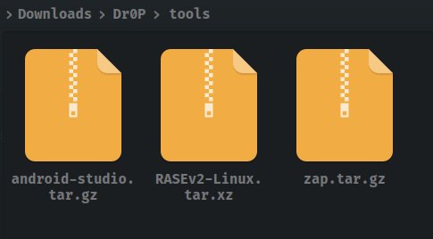

<h1><b>Dr0P - Docker for Pentesting<b></h1>

> **Owner** : Mr. Sup3rN0va | "06-07-2021"

> **Tags** : #docker, #pentest, #mobile, #web, #network, #tool

---

<h2><b>Table Of Contents</b></h2>

---

- [**Introduction**](#introduction)
- [**Installation**](#installation)

---

## **Introduction**

---

- `"Dr0P"` stands for `"Docker for Pentesting"` is a docker image builder for penetration testing
- Dockerfile for `"Dr0P"` currently have tools for `"Mobile Pentesting"` but we can add more related to `Network` and `Web`
- Current gist includes:
  - `Dockerfile`
  - `tools` folder where we need to download latest `Android Studio` and `OWASP ZAP/Burp`. It already has [RASEv2](https://m2sup3rn0va.github.io/RASEv2/) pre-loaded
  - `scripts` folder from where all the startup scripts get copied inside `Docker` image to ease functionality

---

☝️ <a href="#">Back to top</a> ☝️

---

## **Installation**

---

- Download the repo : `git clone https://github.com/m2sup3rn0va/Dr0P.git`

  

- Download latest `Android Studio` and `OWASP ZAP/Burpsuite` as proxy of your choice. If you are using `ZAP`, download the package and not the installer
- Currently `Dockerfile` is configured for `ZAP` only but you can tweak it as per your requirement
- Make sure that you download and save both `Android Studio` and `OWASP ZAP/Burp` in `tools` folder
- Also, make sure that you have renamed downloaded `Android Studio` as `android-studio.tar.gz` and `ZAP` as `zap.tar.gz`
- Thus the contents of `tools` folder :
  - `android-studio.tar.gz`
  - `RASEv2-Linux.tar.xz`
  - `zap.tar.gz`

      

- Now, run : `chmod +x deploy_docker.sh` and `./deploy_docker.sh`
- This will install `docker` for you. Once, the script completes, please `logoff` and `login` back and re-run the script
- The script works in two phases:
  - `Phase-1` : Install `docker` and set it for logged in `$USER`. It also creates `shareDrive` for `docker container`
  - `Phase-2` : Builds `docker` image and creates `docker` container 
- If you want you can save the image locally for future use as : `docker image save <image-id> -o dr0pv1.tar`
- After when you clean the images and docker containers and you want to import back the image you saved locally : `docker load -i dr0pv1.tar`. After that, `docker tag <image-id> dr0p:v1`
- Now you can create the container with this image and run it for pentesting
- Once you are inside the container, the first thing you need to run is : `sudo chown -R user:user /dev/kvm`. Without this you will not be able to run `AVD` inside docker. Obviously to run this command successfully, you need to have `VT-x/AMD-V` enabled at `BIOS` level
- While running the container, `RASEv2` will help in building and rooting the `AVD` created using `Android Studio`. So, make sure that you visit `Github-RASEv2` (linked below) to understand how to install `Android Studio`. Once, installed, just `cd RASEv2-Linux` and `python3 RASEv2.py`
- You can refer to [**RASEv2**](https://m2sup3rn0va.github.io/RASEv2/) for more details

---

☝️ <a href="#">Back to top</a> ☝️
